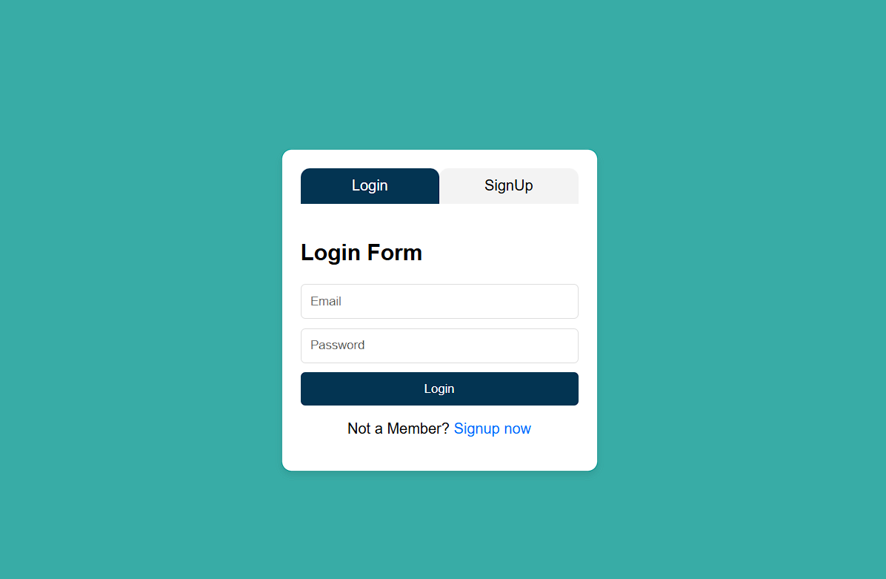
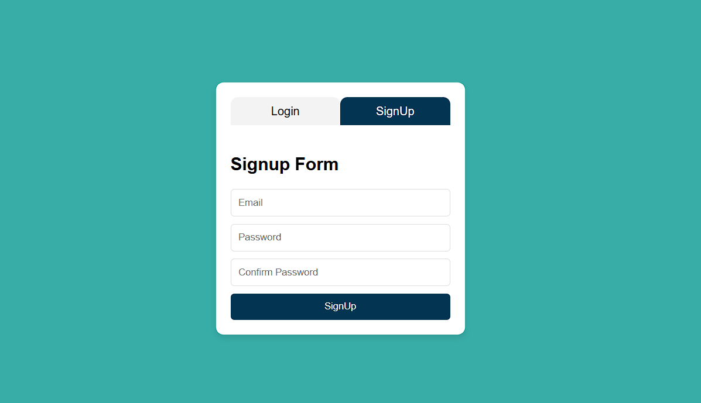

# MyApp: Authentication System with React and Node.js  

   

## Description  

**MyApp** is a secure web-based authentication system designed using **React**, **Node.js**, and **PostgreSQL**. It enables users to log in and sign up with robust password security provided by `bcrypt` and session-based authentication using `passport.js`. The application features dynamic front-end forms built with React and a protected secrets page using EJS templates.  

---

## Features  

- **User Authentication**  
  - Secure login with session management.  
  - Sign up with hashed passwords using `bcrypt`.  

- **Protected Secrets Page**  
  - Accessible only to authenticated users.  
  - Redirects unauthorized users to React-based login/signup forms.  

- **Logout Functionality**  
  - Secure session termination with redirection to the login page.  

- **Dynamic Front-End**  
  - Login and signup forms toggle seamlessly using React.  
  - Styled with **Bootstrap** and **FontAwesome** for a modern UI.  

---

## Tech Stack  

### Frontend  
- **React.js:** Dynamic forms and responsive UI.  
- **EJS:** Template engine for protected content.  
- **Bootstrap & FontAwesome:** Modern styling.  

### Backend  
- **Node.js & Express.js:** RESTful APIs for user management.  
- **PostgreSQL:** Secure user data storage.  

### Others  
- **Bcrypt.js:** For password encryption.  
- **Passport.js:** Session-based authentication middleware.  
- **Dotenv:** For managing environment variables.  
- **Express-session & CORS:** Middleware for secure communication.  

---

## Installation  

### Prerequisites  

Ensure the following are installed on your system:  
- **Node.js** (v14 or later)  
- **PostgreSQL**  
- **Git**  

### Environment Variables  

Create a `.env` file in the root directory and configure the following variables:  
```env  
PG_USER=your_database_user  
PG_PASSWORD=your_database_password  
PG_HOST=localhost  
PG_DATABASE=your_database_name  
PG_PORT=5432  
SESSION_SECRET=your_secret_key  
```  

### Steps  

#### 1. Clone the Repository  

Clone the repository to your local machine:  
```bash  
git clone https://github.com/your-repo/myapp.git  
cd myapp  
```  

#### 2. Install Dependencies  

Install Node.js dependencies:  
```bash  
npm install  
```  

#### 3. Set Up the Database  

Log in to your PostgreSQL instance and create the `users` table:  
```sql  
CREATE TABLE users (  
    id SERIAL PRIMARY KEY,  
    email VARCHAR(255) UNIQUE NOT NULL,  
    password VARCHAR(255) NOT NULL  
);  
```  

#### 4. Run the Backend Server  

Start the Node.js server:  
```bash  
npm start  
```  
The backend server will run at [http://localhost:3000](http://localhost:3000).  

#### 5. Start the React Client  

Navigate to the `client` directory, install dependencies, and start the React server:  
```bash  
cd client  
npm install  
npm start  
```  
The React client will run at [http://localhost:5173](http://localhost:5173).  

---

## Usage  

Once the backend and frontend servers are running, access the application in your browser:  

- **Home Page:** Welcomes authenticated users after login.  
- **Secrets Page:** Displays restricted content accessible only to logged-in users.  
- **Login & Sign-up:** Use React-based forms for authentication.  
- **Logout:** Securely end your session and return to the login page.  

---  

## Future Enhancements  

- Add **OAuth** for third-party authentication.  
- Implement email verification during signup.  
- Enhance the secrets page with more interactive content.  
- Add multi-factor authentication (MFA) for added security.  
